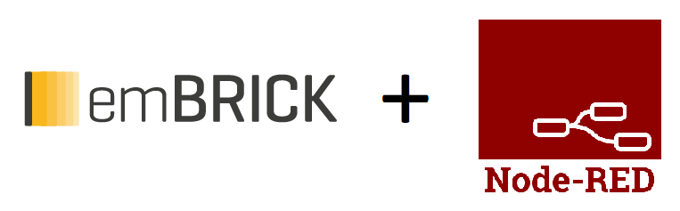

  

# node-red-contrib-embrick

This Module provides a Method to use your emBrick I/O Systems in Node-Red.

## Required
* current Version of [Node.js](https://nodejs.org/en/download/) & [Node-RED](https://nodered.org/docs/getting-started/)
* node-red-dashboard        // for the Dashboard
* node-red-contrib-config   // to set a flow value on start
* node-red-contrib-modbus   // If the Remote Master is connected serial
* node-red-contrib-boolean-logic-ultimate  // optionaly if you need AND,OR,XOR Gatter or a inverter Node
