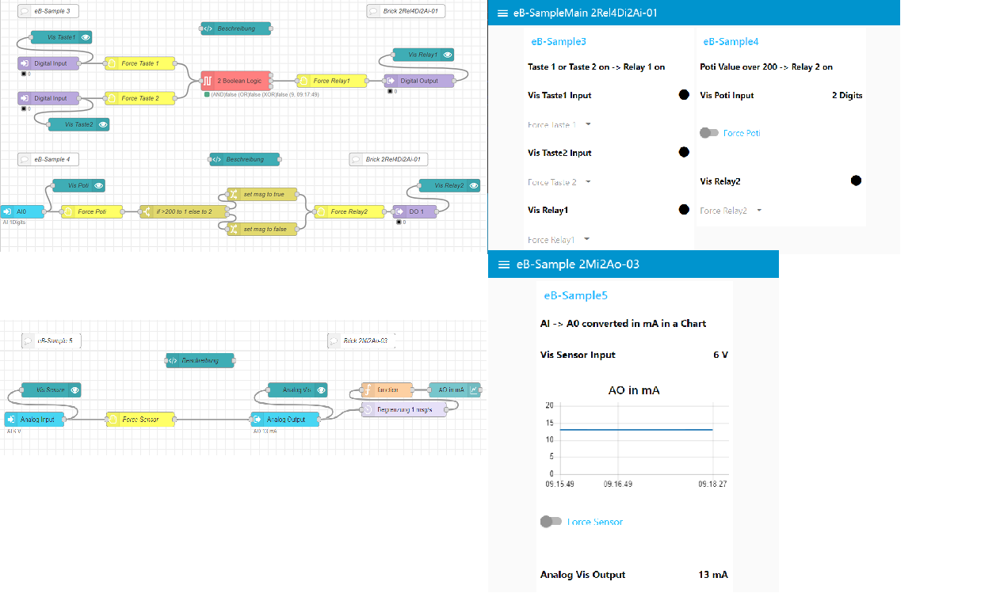
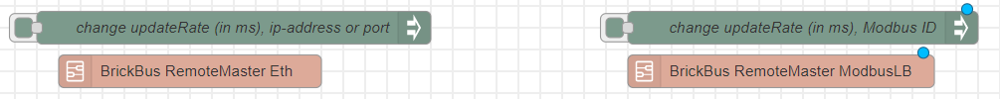

  

# node-red-contrib-embrick
[](https://nodered.org)

This Module provides a Method to use your emBrick I/O Systems in Node-Red.

## Required
* current Version of [Node.js](https://nodejs.org/en/download/) & [Node-RED](https://nodered.org/docs/getting-started/)
* [node-red-dashboard](https://flows.nodered.org/node/node-red-dashboard) (for the Dashboard)
* [node-red-contrib-config](https://flows.nodered.org/node/node-red-contrib-config) (to set a flow value on start)
* [node-red-contrib-modbus](https://flows.nodered.org/node/node-red-contrib-modbus) (If the Remote Master is connected serial)
* [node-red-contrib-boolean-logic-ultimate](https://flows.nodered.org/node/node-red-contrib-boolean-logic-ultimate) (optionaly if you need AND,OR,XOR Gatter or a inverter Node)



## Install
To install use the 'Menu - Palette verwalten' option and search for 'node-red-contrib-embrick' or run the following command in your Node-RED user directory - typically `~/.node-red`:

    npm i @embrick/red-contrib-embrick

Restart your Node-RED instance and you should have UI nodes available in the palette and a new `dashboard` tab in the
right side panel. The UI interface is available at <http://localhost:1880/ui> (if the default settings are used).

## Settings Dashboard

The default url for the dashboard is based off your existing Node-RED httpRoot path with /ui added. This can be changed in your Node-RED settings.js file.

```
ui: { path: "ui" },
```

## Settings Connection

Double Click on 'change updateRate (in ms), ip-address or port' if you use the Remote Master per Ethernet to change the Updaterate (in ms), ip-address or port.
Double Click on 'change updateRate(in ms), Modbus ID' if you use the Remote Master per Serial to change the Updaterate (in ms) or the Modbus ID.

## Functions of the Nodes

| node                        | function                                                              
| --------------------------- | ----------------------------------------------------------------------------------------------------------------- |  
| Digital Input               | gives the State of the Input as msg.payload (1 or 0) out.                                                         |
| Digital Output              | write the Input msg.payload on the Output (1 or 0 ).                                                              |
| Digital Vis                 | show the State with a LED Icon (1 = yellow, 0 = black) of the Digital In- or Output  on the Dashboard.            |
| Digital Force               | give the opportunity to force the Digital In- or Output on the Dashboard.                                         |
| Analog Input                | gives the Value of the Input in Process Value(if configured in node) or in digits as msg.payload out.             |
| Analog Output               | write the Input msg.payload on the Output.                                                                        |
| Analog Vis                  | show the State in Process Value(if configured in node) or in digits of the Analog In- or Output on the Dashboard. |
| Analog Force                | gives the opportunity to force the Analog In- or Output on the Dashboard.                                         |
